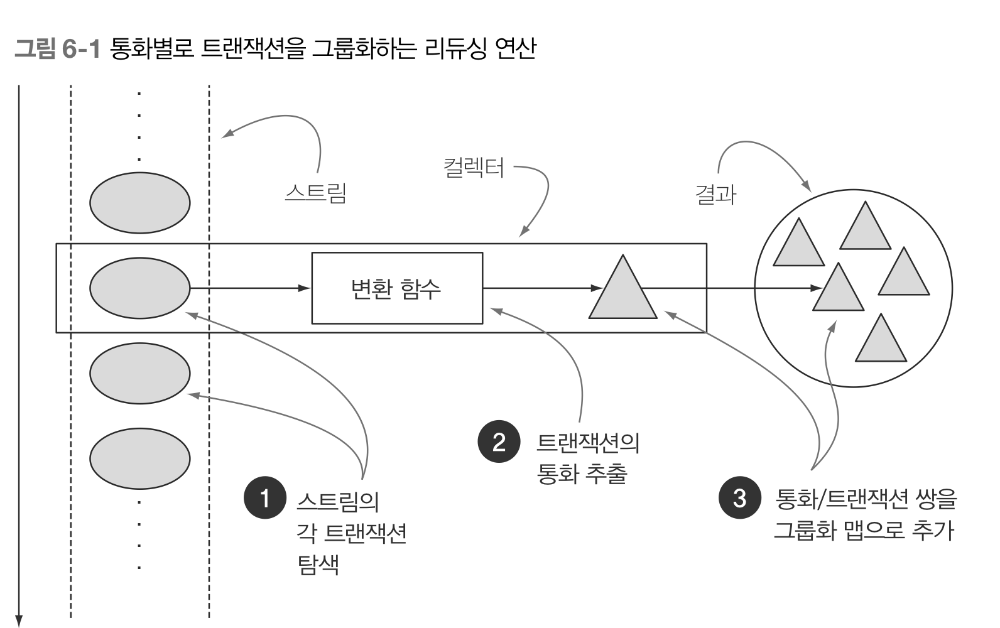
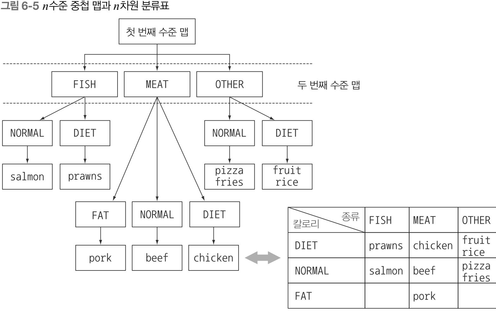
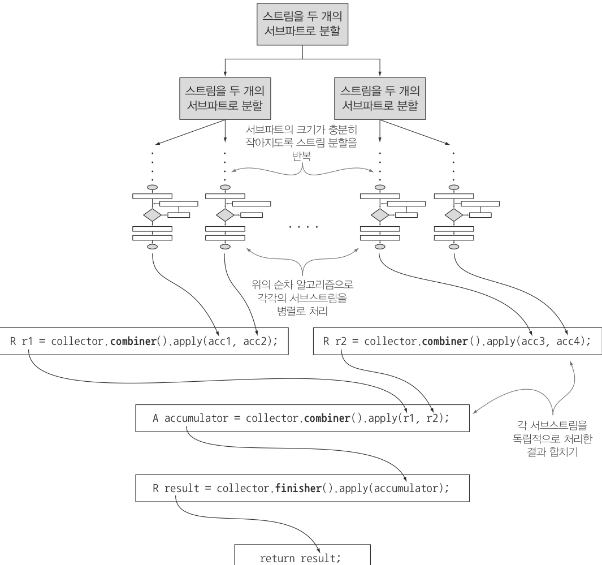
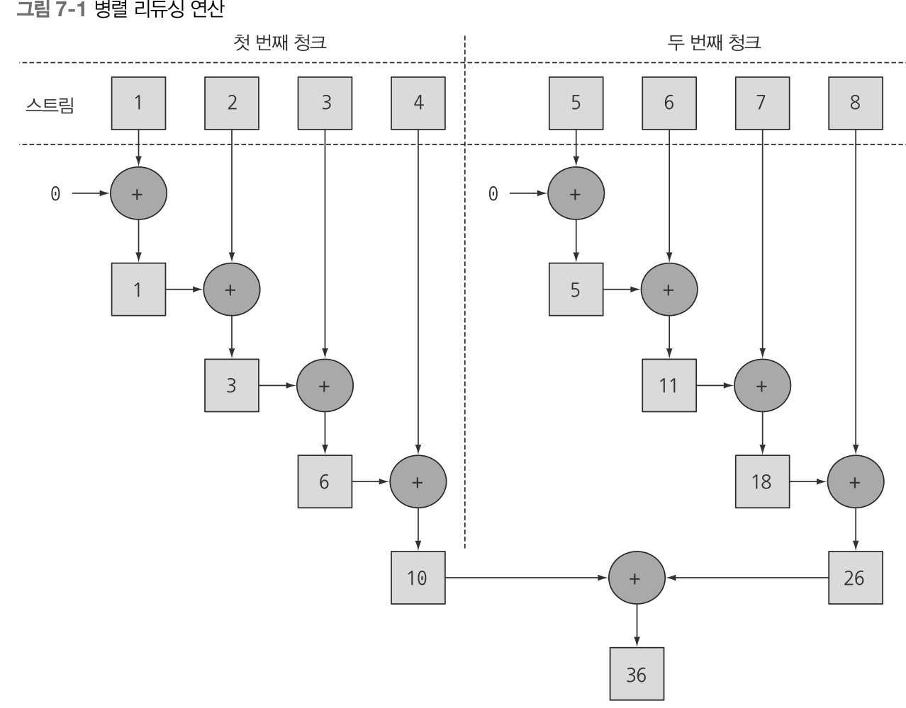
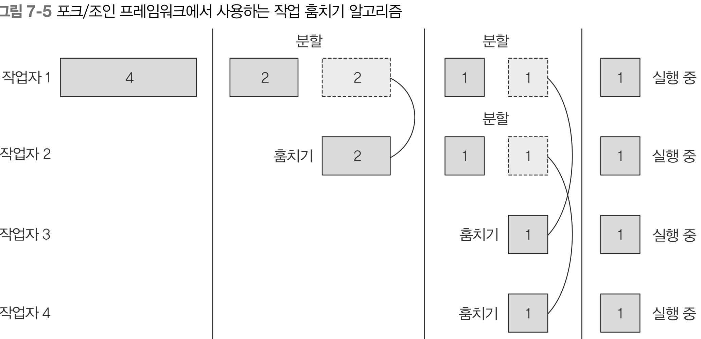
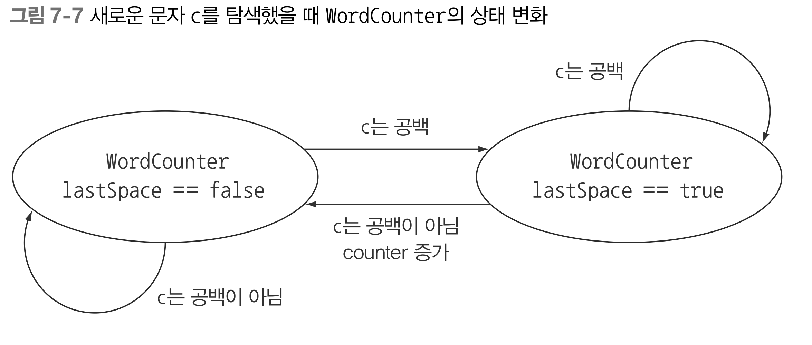

# Part2

## 📔 CHAPTER4 스트림 소개

### 🔎 스트림이란?

**데이터 연산을 지원하도록 소스에서 추출된 연속된 요소**

- 연속된 요소 : 특정 요소 형식으로 이루어진 연속된 값 집합의 인터페이스를 제공
- 소스 : 정렬된 컬렉션으로 스트림을 생성하면 정렬이 유지됨
- 데이터 처리연산: 데이터베이스와 비슷한 연산을 지원, 순차적 혹은 병렬적으로 실행 가능
- 파이프라이닝 : 스트림 연산끼리 연결해서 커다란 파이프 라인을 구성할 수 있도록 자신을 반환
- 내부 반복 : 내부 반복을 지원

```java
List<String> threeHighCaloricDishNames =
   menu.stream() //<- 스트림 얻기
      .filter(dish -> dish.getCalories() > 300) //<- 파이프라인
      .map(Dish::getName)
      .limit(3)
      .collect(toList());
```

### 데이터 처리 연산

- filter : 람다를 인수로 받아 스트림에서 특정 요소를 제외
- map : 람다를 이용하여 다른요소로 변환, 정보추출
- limit : 정해진 개수 이상의 요소가 저장되지 못하게 스트림 크기를 제한
- collect : 스트림을 다른 형식으로 변환

### 스트림 VS 컬렉션

- 공통점
  - 연속된(순차적으로 값에 접근) 요소형식의 값을 저장하는 자료구조의 인터페이스를 제공
- 차이점
  - 컬렉션
    1. 모든 값을 메모리에 저장 &rarr; 즉, 컬렉션의 모든 요소는 컬렉션에 추가하기 전에 계산되어야함
    1. 적극적으로 생성됨
    1. 외부 반복 : 사용자가 직접 요소를 반복
  - 스트림
    1. 이론적으로 요청할때만 요소를 계산
    1. 한번만 탐색 가능 &rarr; 다시 탐색할려면 새로운 스트림 필요
    1. 내부 반복 : 반복을 알아서 처리

### 스트림 연산

스트림의 연산은 중간연산, 최종연산으로 구분된다.

- 중간연산 : 다른 스트림을 반환하므로 여러 중간 연산을 연결해 질의를 만들 수 있다. 중요한 특징은 단말 연산을 스트림
  파이프라인에 실행하기 전까지는 아무 연산도 수행하지 않는다는것 즉 **게으르다(lazy)** 는것 &rarr;최적화 효과를 얻을 수 있음

| 연산     | 반환형식  | 연산의 인수    | 함수 디스크립터 |
| -------- | --------- | -------------- | --------------- |
| filter   | Stream<T> | Predicate<T>   | T -> boolean    |
| map      | Stream<R> | Function<T, R> | T -> R          |
| limit    | Stream<T> |                |                 |
| sorted   | Stream<T> | Comparator<T>  | (T, T) -> int   |
| distinct | Stream<T> |                |                 |

- 최종연산 : 결과를 도출

| 연산    | 반환형식 | 목적                                                    |
| ------- | -------- | ------------------------------------------------------- |
| forEach | void     | 스트림의 각 요소를 소비하면서 람다를 적용               |
| count   | long     | 스트림의 요소 개수를 반환                               |
| collect |          | 스트림을 리듀스해서 리슽, 맵, 정수 형식의 컬렉션을 만듬 |

## 📔 CHAPTER5 - 스트림 활용

### 필터링

1. Predicate로 필터링(filter())
2. 고유 요소 필터링(distict())

### 슬라이싱

1. Predicate를 이용한 슬라이싱
   - TAKEWHILE : 이미 정렬이 된 리스트의 경우 takeWhile을 사용하여 Predicate가 거짓일 경우 반복작업을 중단
   - DROPWHILE : TAKEWHILE의 반대로 dropWhile을 사용할경우 처음으로 거짓이 되는 지검까지 발견된 요소를 버리고 남은 모든 요소를 반환
2. 스트림 축소(limit())
3. 요소 건너뛰기(skip())

### 매핑

1. 스트림의 각 요소에 함수 적용(map())
2. 스트림 평면화(flatMap())

### 검색과 매칭

1. Predicate가 적어도 한 요소와 일치하는지 확인(anyMatch())
2. Predicate가 모든 요소와 일치/불일치하는지 검사(allMatch(), noneMatch())
3. 요소 검색(findAny())
4. 첫 번째 요소 찾기(findFirst())

### 리듀싱

reduce를 활용하여 요소의 합, 최대/최소값 등을 구할수 있다.

### 숫자형 스트림

1. 기본형 특화 스트림(mapToInt())
2. 숫자 범위(rangeClosed())

### 스트림 만들기

1. 값으로 스트림 만들기 (Stream.of())
2. null이 될수 있는 객체로 스트림 만들기(Stream.ofNullable())
3. 배열로 스트림 만들기(Arrays.stream(arr))
4. 파일로 스트림 만들기
5. 함수로 무한 스트림 만들기(Stream.iterate, Stream.generate)

## 📔 CHAPTER6 - 스트림으로 데이터 수집

### 고급 리듀싱 기능을 수행하는 컬렉터

스트림에 collect를 호출하면 스트림의 요소에 리듀싱 연산이 수행된다. 이를 통해 컬랙터가 각 요소를 방문하면서 작업을 처리한다.


미리 정의된 컬렉터는 팩토리 메서드의 기능을 설명한다. Collectors에서 제공하는 기능은 크게 세가지로 구분할 수 있다.

- 스트림 요소를 하나의 값으로 리듀스 하고 요약  
  다양한 계산을 수행할 때 이를 유용하게 활용
- 요소 그룹화  
  다수준으로 그룹화, 서브그룹에 추가로 리듀싱
- 요소 분할  
  한개의 인수를 받아 불리언을 반환하는 Predicate를 사용

### Collectors의 리듀싱과 요약

1. 최대값/최대값 검색(maxBy, minBy)
2. 요약 연산(summingInt, averagingInt, summarizingInt)
3. 문자열 연결(joining)
4. 범용 리듀싱 요약 연산(reducing)

### 그룹화

1. 그룹화된 요소 조작(groupingBy)  
   collector안으로 프레디케이트를 이동할 수 있다.

```java
groupingBy(Dish::getType, filtering(dish -> dish.getCaloies > 500, toList()));
groupingBy(Dish::getType, mapping(Dish;;getName, toList()));
groupingBy(Dish::getType, flatMapping(dish -> dishTags.get(dish.getName()).stream(), toSet());
```

2. 다수준 그룹화

```java
groupingBy(Dish::getType,
    groupingBy(dish -> {
       if (dish.getCalories() <= 400)
          return CaloricLevel.DIET;
       else:
          return CaloricLevel.FAT;
    })
```



3. 서브그룹으로 데이터 수집

```java
groupingBy(Dish::getType, counting);
groupingBy(Dish::getType, maxBy(comparingInt(Dish::getCalories)));
groupingBy(Dish::getType, collectingAndThen(maxBy(comparingInt(Dish::getCalories)), Optional::get));
```

collectingAndThen은 적용할 컬렉터와 변환함수를 인수로 받아 다른 컬렉터를 반환,

### 분할

분할은 분할 함수라 불리는 Predicate를 분류 함수로 사용하는 특수한 그룹화 기능이다. 불리언을 반환하므로 맵의 키 형식은 Boolean이다. 결과적으로 최대 T/F 두개의 그룹으로 분류된다.

1. 분할의 장점 : 분할 함수가 반환하는 참, 거짓 두가지 요소의 스트림 리스트를 모두 유지한다는 것
   ```java
   menu.stream().collect(partitioningBy(Dish::isVegetarian, groupingBy(Dish::getType)));
   ```

### Collector 인터페이스

Collector 인터페이스는 리듀싱 연산을 어떻게 구현할지 제공하는 메서드 집합으로 구성됨

```java
public interface Collector<T, A, R> {
   Supplier<A> supplier();
   BiConsumer<A, T> accumulator();
   Function<A, R> finisher();
   BinaryOperator<A> combiner();
   Set<Characteristics> characteristics();
}
```

- T는 수집될 스트림 항목의 제네릭 형식
- A는 누적자. 즉 수집 과정에서 중간 결과를 누적하는 객체의 형식
- R은 수집 연산 결과 객체의 형식

1. supplier 메서드 : 새로운 결과 컨테이너 만들기  
   supplier 메서드는 빈 결과로 이루어진 Supplier을 봔한해야 함

```java
public Supplier<A> supplier(){
   return () -> new ArrayList<T>();
   return ArrayList::new;
}
```

2. accumulator 메서드 : 결과 컨테이너에 요소 추가하기
   accumulator 메서드는 리듀싱 연산을 수행하는 함수를 반환

```java
public BiCounsumer<List<T>, T> accumulator(){
   return (list, item) -> list.add(item);
   return List::add;
}
```

3. finisher 메서드 : 최종 변환값을 결과 컨테이너로 적용하기
   finisher 메서드는 스트림 탐색을 끝내고 누적자 객체를 최종 결과로 변환하면서 누적 과정을 끝낼 때 호출할 함수를 반환

```java
public Function<List<T>, T> finisher(){
   return Function.identity();
}
```

4.  combiner 메서드 : 두 결과 컨테이너 병합
    combiner는 스트림의 서로 다른 서브파트를 병렬로 처리할대 누적자가 어떻게 이 결과를 처리할지 정의

```java
public BinaryOperator<List<T>> combiner(){
   return (list1, list2) -> {
      list1.add(list2);
      return list1;
   }
}
```

 5. Characteristics 메서드
characteristics 메서드는 컬렉터의 연산을 정의하는 Characteristics 형식의 불변 집합을 반환. 스트림을 병렬로 리듀스 할것인지, 어떠한 최적하를 선택할지 힌트를 제공

- UNORDERED : 리듀싱 결과는 스트림의 요소의 방문 순서나 누적 순서에 영향을 받지 않는다.
- CONCURRENT : 다중 스레드에서 accumulate함수를 동시에 호출 할 수 있으며 스트림의 병렬 리듀싱을 수행할 수 잇다.
- IDENTITY_FINISH : finisher 메서드가 반환하는 함수는 단순히 identity를 적용할 뿐이므로 생략 가능.

### 커스텀 컬렉터 구현

1. Collector 클래스 시그니처 정의

```java
  public class PrimNumbersCollecotr implements Collector<Integer, Map<Boolean, List<Integer>>, Map<Boolean, List<Integer>>>{}
```

2. 리듀싱 연산 구현

```java
  public Supplier<Map<Boolean, List<Integer>>> supplier(){
      return () -> new HashMap<Boolean, List<Integer>>() {{
         put(true, new ArrayList<Integer>());
         put(false, new ArrayList<Integer>());
      }};
  }

  public BiConsumer<Map<Boolean, List<Integer>>, Integer> accumulator() {
       return (Map<Boolean, List<Integer>> acc, Integer candidate) -> {
            acc.get( isPrime(acc.get(true), candidate) ).add(candidate);
      };
   }
```

3. 병렬 실행할 수 있는 컬렉터 만들기 (가능하다면)

```java
public BinaryOperator<Map<Boolean, List<Integer>>> combiner() {
      return (Map<Boolean, List<Integer>> map1, Map<Boolean, List<Integer>> map2) -> {
               map1.get(true).addAll(map2.get(true));
               map1.get(false).addAll(map2.get(false));
               return map1;
         };
      }
```

4. finisher메서드와 컬렉터의 characteristics 메서드

```java
public Function<Map<Boolean, List<Integer>>, Map<Boolean, List<Integer>>> finisher() {
       return Function.identity();
   }

public Set<Characteristics> characteristics() {
      return Collections.unmodifiableSet(EnumSet.of(IDENTITY_FINISH));
}
```

## 📔 CHAPTER7 - 병렬 데이터 처리와 성능

### 병렬 스트림

### 🔎 병렬 스트림이란?

각각의 스레드에서 처리할 수 있도록 스트림 요소를 여러 청크로 분할한 스트림 &rarr; 모든 멀티코어 프로세서가 각각의 청크를 처리하도록 할당할 수 있다.

1. 순차 스트림을 병렬 스트림으로 변환하기
   순차 스트림에 parallel메서드를 호출하면 기존의 함수형 리듀싱 연산이 병렬로 처리된다.

```java
public long parallelSum(long n) {
      return Stream.iterate(1L, i -> i + 1)
         .limit(n)
         .parallel()
         .reduce(0L, Long::sum);
}
```



순차 스트림에 parallel을 호출해도 스트림자체에는 아무 변화도 일어나진 않지만 parallel 호출시 병렬로 수행해야 함을 의미하는 불리언 플래그가 설정된다. 반대로 sequential로 병렬 스트림을 순차 스트림으로 바꿀 수 있다.

2. 병렬 스트림의 올바른 사용방법

```java
public long sideEffectSum(long n) {
   Accumulator accumulator = new Accumulator();
   LongStream.rangeClosed(1, n).forEach(accumulator::add);
   return accumulator.total;
}
public class Accumulator {
   public long total = 0;
   public void add(long value) {
      total += value;
   }
}
```

위 코드는 순차신행할 수 있도록 구현되어 있으므로 병렬로 실행시 total에 접근할 대마다 데이터 레이스 문제가 일어난다. 동기화로 문제를 해결하다보면 결국 병렬화라는 특성이 없어져 버릴 것이다.

```java
public long sideEffectParallelSum(long n) {
   Accumulator accumulator = new Accumulator();
   LongStream.rangeClosed(1, n).parallel().forEach(accumulator::add);
   return accumulator.total;
}
```

위 코드처럼 병렬로 만든 경우 메서드의 성능은 둘째치고 올바른 결과값이 나오지 않는다. total += value를 실행하며
아토믹 연산 같이 보이는 이 연산은 여러 스레드에서 공유하는 객체의 상태를 바꾸는 forEach블록 내부에서 add를 호출하며 이와 같은 문제가 발생한다. 이러한 상황을 피하기 위해 상태 공유에 따른 부작용을 피해야 한다.

3. 병렬 스트림 효과적으로 사용하기

- 순차 스트림과 병렬 스트림 중 어떤 것이 좋을지 모르겠다면 벤치마킹
- 박싱 주의 &rarr; 기본형 특화 스트림 사용
- limit, findFirst처럼 요소의 순서에 의존하는 연산은 병렬 스트림으로 처리시 비싼 비용이 듬.
- 전체 파이프라인 연산 비용을 고려하기
- 소량의 데이터는 병렬 스트림이 도움되지 않음
- 스트림의 자료구조가 적절한지 확인하기
- 스트림의 특성과 파이프라인의 중간 연산이 스트림의 특성을 어떻게 바꾸는지에 따라 분해 과정의 성능이 달라질 수 있음
- 최종 연산의 병합 과정 비용을 살펴보기
- 병렬 스트림이 수행되는 내부 인프라 구조 살펴보기

| 소스            | 분해성 |
| --------------- | ------ |
| ArrayList       | 훌륭함 |
| LinkedList      | 나쁨   |
| IntStream.range | 훌륭함 |
| Stream.iterate  | 나쁨   |
| HashSet         | 좋음   |
| TreeSet         | 좋음   |

### 포크/조인 프레임워크

포크/조인 프레임워크는 병렬화할 수 있는 작업을 재귀적으로 작은 작업으로 분할한 다음에 서브태스크 결과를 합쳐 전체 결과를 만들도록 설계됨

1. Recursive Task 활용
   분할정복알고리즘의 병렬화 버전.

```java
//RecursiveTask를 상속받아 포크/조인 프레임워크에서 생성할 태스크 생성
public class ForkJoinSumCalculator extends java.util.concurrent.RecursiveTask<Long> {
   private final long[] numbers;
   private final int start;
   private final int end;
   public static final long THRESHOLD = 10_000;

   public ForkJoinSumCalculator(long[] numbers){
      this(numbers, 0, numbers.length);
   }

   private ForkJoinSumCalculator(long[] numbers, int start, int end) {
      this.numbers = numbers;
      this.start = start;
      this.end = end;
   }

   @Override
   protected Long compute(){
      int length = end - start;
      //한계치 보다 같거나 작은경우 순차적으로 계산
      if (length <= THRESHOLD) {
         return computeSequentially();
      }
      //그렇지 않은 경우엔 절반씩 나눠 두개의 서브태스크 생성
      ForkJoinSumCalculator leftTask = new ForkJoinSumCalculator(numbers, start, start + length/2);
      //비동기로 실행
      leftTask.fork();
      ForkJoinSumCalculator rightTask = new ForkJoinSumCalculator(numbers, start + length/2, end);
      //두번째 서브태스크를 동기로 실행
      Long rightResult = rightTask.compute();
      Long leftResult = leftTask.join();
      return leftResult + rightResult;
   }

   private long computeSequentially() {
      long sum = 0;
      for (int i = start; i < end; i++){
         sum += numbers[i];
      }
      return sum;
   }
}
```

2. 포크/조인 프레임워크 제대로 사용하는 방법

- join메서드를 태스크에 호출하면 태스크가 생산하는 결과가 준비될 때까지 호출자를 블록시킨다. 따라서 두 서브태스크가 모두 시작된 다음 join을 호출해야한다. 그렇지 않으면 각각의 서브태스크가 다른 태스크가 끝나길 기다리는 일이 발생한다.
- RecursiveTask 내에서는 ForkJoinPool의 invoke 메서드를 사용하지 말아야 한다. 대신 compute나 fork 메서드를 직접 호출할 수 있다. 순차 코드에서 병렬 계산을 시작할 때만 invoke를 사용한다.
- 왼쪽 작업과 오른쪽 작업 모두에 fork 메서드를 호출하는 것이 자연스러울 것 같지만 한쪽 작업 에는 fork를 호출하는 것보다는 compute를 호출하는 것이 오버헤드를 피할 수 있다.
- 스택 트레이스가 도움이 되지 않는다.
- 병렬 스트림에서 살펴본 것처럼 멀티코어에 포크/조인 프레임워크를 사용하는 것이 순 차 처리보다 무조건 빠를 거라는 생각은 버려야 한다. 병렬 처리로 성능을 개선하려면 태 스크를 여러 독립적인 서브태스크로 분할할 수 있어야 한다.

3. 작업 훔치기
   포크/조인 프레임워크에서는 작업 훔치기라는 기법을 통해 시간 문제를 해결한다. 스레드를 거의 공정하게 분할함으로써 각각 스레드는 할당된 태스크를 포함하는 이중 연결 리스트를 참조하며 작업이 끝날때 마다 큐에서 다른 태스크를 가져와 작업을 처리하고 유휴 상태 직전의 스레드는 큐의 꼬리에서 작업을 훔쳐와 스레드 간의 작업부하를 비슷한 수준으로 유지할 수 있다.
   

### Spliterator 인터페이스

Iterator처럼 Spliterator는 소스의 요소 탐색 기능을 제공한다는 점은 같지만 병렬 작업에 특화되어 있다.

```java
public interface Spliterator<T> {
      boolean tryAdvance(Consumer<? super T> action);
      Spliterator<T> trySplit();
      long estimateSize();
      int characteristics();
}
```

- tryAdvance : 탐색해야 할 요소가 있으면 참을 반환
- trySplit : 일부 요소를 분할해서 두번째 Spliterator을 생성하는 메서드
- estimateSize : 탐색해야할 요소 수 정보 제공

1. 분할 과정
   trySplit의 결과가 null이면 재귀 분할 과정이 종료됨  
   Spliterator 특성

| 특성       | 의미                                                                                                      |
| ---------- | --------------------------------------------------------------------------------------------------------- |
| ORDERED    | 리스트처럼 요소에 정해진 순서가 있으므로 Spliterator는 요소를 탐색하고 분할할 때 이 순서에 유의해야 한다. |
| DISTINT    | x, y 두 요소를 방문했을 때 x.equals(y)는 항상 false를 반환한다.                                           |
| SORTED     | 탐색된 요소는 미리 정의된 정렬 순서를 따른다.                                                             |
| SIZED      | 크기가 알려진 소스로 생성했으므로 estimatedSize()는 정확한 값을 반환한다.                                 |
| NON-NULL   | 탐색하는 요소는 null이 아니다.                                                                            |
| IMMUTABLE  | 이 Spliterator 소느는 불편이다. 즉 요소를 탐색하는 동안 요소를 추가하거나 삭제하거나 고칠 수 없다.        |
| CONCURRENT | 동기화 없이 Spliterator의 소스를 여러 스레드에서 동시에 고칠 수 있다.                                     |
| SUBSIZED   | 이 Spliterator 그리고 분할되는 모든 Spliterator는 SIZED 특성을 갖는다.                                    |

2. 커스텀 Spliterator 구현하기

```java
class WordCounter{
   private final int counter;
   private final boolean lastSpace;
   public WordCounter(int counter, boolean lastSpace) {
      this.counter = counter;
      this.lastSpace = lastSpace;
   }

   public WordCounter accumulate(Character c){
      if (Character.isWhitespace(c)){
         return lastSpace? this : new WordCounter(counter +1, false);
      } else {
         return lastSpace ? new WordCounter(counter + 1, false) : this;
      }
   }

   public WordCounter combine(WordCounter wordCounter) {
      return new WordCounter(counter + wordCounter.counter, wordCounter.lastSpace);
   }

   public int getCounter(){
      return counter;
   }
}
```



```java
class WordCounterSpliterator implements Spliterator<Character> {
    private final String string;
    private int currentChar = 0;
    public WordCounterSpliterator(String string) {
       this.string = string;
    }

    @Override
    public boolean tryAdvance(Consumer<? super Character> action) {
          action.accept(string.charAt(currentChar++));
          return currentChar < string.length();
    }

    @Override
    public Spliterator<Character> trySplit() {
          int currentSize = string.length() - currentChar;
          if (currentSize < 10) {
             return null;
          }
          for (int splitPos = currentSize / 2 + currentChar; splitPos < string.length(); splitPos++) {
             if (Character.isWhitespace(string.charAt(splitPos))){
                Spliterator<Character> =  new WordCounterSpliterator(string.substring(currentChar,  splitPos));
                currentChat = splitPos;
                return spliterator;
             }
          }
          return null;
    }

    @Override
    public long estimateSize() {
       return string.length() - currentChar;
    }
    @Override
    public int characteristics() {
          return ORDERED + SIZED + SUBSIZED + NON-NULL + IMMUTABLE;
    }
}
```

- tryAdvance 메서드는 문자열에서 현재 인덱스에 해당하는 문자를 Consumer에 제공한 다음에 인덱스를 증가. 인수로 전달된 Consumer는 스트림을 탐색하면서 적용해야 하는 함수 집합이 작업을 처리할 수 있도록 소비한 문자를 전달하는 자바 내부 클래스이다.
- trySplit은 반복될 자료구조를 분할하는 로직을 포함하므로 Spliterator에서 가장 중요한 메서드. 분할 동작을 중단할 한계를 설정. 분할 과정에서 남은 문자 수가 한계값 이하면 null을 반환. 반대로 분할이 필요한 상황에는 파싱해야 할 문 자열 청크의 중간 위치를 기준으로 분할하도록 지시. 이때 단어 중간을 분할하지 않 도록 빈 문자가 나올때까지 분할 위치를 이동.
- 탐색해야 할 요소의 개수(estimatedSize)는 Spliterator가 파싱할 문자열 전체 길이 (string.length ( ) )와 현재 반복 중인 위치(currentChar )의 차.
- 마지막으로 characteristic 메서드는 프레임워크에 Spliterator가 ORDERED , SIZED (estimatedSize 메서드의 반환값이 정확함), SUBSIZED , NONNULL , IMMUTABLE 등의 특성임을 알려준다.
