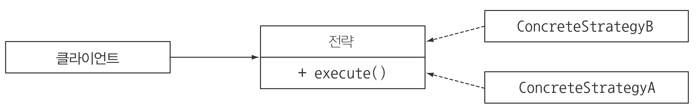
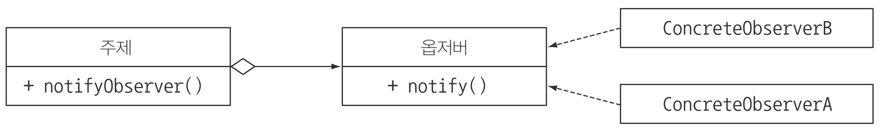

# Part3

## 📔 CHAPTER8 컬렉션 API 개선

### 🔎 컬랙션 팩토리

```java
List<String> friends = new ArrayList<>();
friends.add("Raphael");
friends.add("Olivia");
friends.add("Thibaut");

=>

List<String> friends = Arrays.asList("Raphael", "Olivia", "Thibaut");
//고정 길이의 리스트 생성
```

내부적으로 고정된 크기의 배열의 요소 추가시 `UnsupportedOperationException` 예외발생

1. 리스트 팩토리

`List.of` 팩토리 메소드를 통해 간단히 변경할 수 없는리스트 생성 가능

```java
List<String> friends = List.of("Raphale", "Olivia", "Thibaut");
```

하지만 이 경우 변경할 수 없는 리스트가 생성되었으므로 요소 추가시 `UnsupportedOperationException` 발생

2. 집합 팩토리

`Set.of` 팩토리 메소드를 통해 간단히 변경할 수 없는 집합 생성 가능

```java
Set<String> friends = Set.of("Raphale", "Olivia", "Thibaut");
```

하지만 이 경우 변경할 수 없는 집합ㅇ 생성되었으므로 요소 추가시 `UnsupportedOperationException` 발생

3. 맵 팩토리

`Map.of` 팩토리 메소드를 통해 간단히 변경할 수 없는 집합 생성 가능

```java
Map<String, Integer> friends = Set.of("Raphale", 30, "Olivia", 20, "Thibaut", 25);
```

하지만 이 경우 변경할 수 없는 집합ㅇ 생성되었으므로 요소 추가시 `UnsupportedOperationException` 발생

### 리스트와 집합 처리

List, Set의 추가된 메서드

- removeIf : 프레디케이트를 만족하는 요소 제거
- replaceAll : 리스트에서 UnaryOperator을 통해 요소를 바꿈
- sort : List 제공하는 기능으로 정렬

1. removeIf

```java
   for (Transaction transaction : transactions) {
       if(Character.isDigit(transaction.getReferenceCode().charAt(0))) {
           transactions.remove(transaction);
       }
   }
```

위 경우 `ConcurrentModificationException 발생`
이를 방지하기위해 removeIf 사용

2. replaceAll
   기존의 컬렉션을 바꾸기 위해 사용

```java
referenceCodes.replaceAll(code -> Character.toUpperCase(code.charAt(0)) + code.substring(1));
```

### Map 처리

1. forEach
   forEach문을 간편하게 하기 위해 제공
   키와 값을 인수로 받는 BiConsumer을 지원

```java
ageOfFriends.forEach((friend, age) -> System.out.println(friend + " is " +age + " years old"));
```

2. 정렬 메서드

- Entry.comparingByValue
- Enrty.comparingByKey

```java
favouriteMovies
       .entrySet()
       .stream()
       .sorted(Entry.comparingByKey())
       .forEachOrdered(System.out::println);
```

3. getOrDefaul
   NullPointerException을 방지하기 위해 사용,
   첫번째 인수로 키, 두번째 인수로 기본값.

```java
System.out.println(moveis.getOrDefault("Oliva", "Matrics"));
```

4. 계산 패턴

- computeIfAbsent : 키가 없음 null 있으면 키를 이용해 계산, 맵에 추가
- computeIfPresent : 키가 존재하는 경우 계산하고 맵에 추가
- compute : 제공된 키로 계산, 맵에 추가

5. 삭제 패턴
   remove 를 통해 기존에 key, value를 모두 if를 통해 했던 불편한 작업을 제거

6. 교체 패턴

- replaceAll : BiFunction을 통해 각 항목의 값을 교체
- replace : 키가 존재하면 맵의 값을 바꿈

7. 합침

- putAll : 두 맵을 합침
- merge : 두 맵을 BiFunction 을 통해 유연하게 합침

### ConcurrentHashMap

1. 리듀스와 탐색

- forEach:각(키,값)쌍에주어진액션을실행
- reduce:모든(키,값)쌍을제공된리듀스함수를이용해결과로합침
- search:널이아닌값을반환할때까지각(키,값)쌍에함수를적용

2. 계수
   맵의 매핑 계수를 반환하는 mappingCount 메서드를 제공

3. 집합뷰
   집합 뷰로 반환하는 keySet메서드 제공
   newKeySet을 통해 ConcurrentHashMap으로 유지되는 집합 생성 가능

## 📔 CHAPTER9 리팩터링, 테스팅, 디버깅

### 가독성과 유연성을 개선하는 리팩터링

1. 코드 가독성 개선

- 익명 클래스를 람다 표현식으로 리팩터링
- 람다 표현식을 메서드 참조로 리팩터링
- 명령형 데이터 처리를 스트림으로 리팩터링

2. 익명 클래스를 람다 표현식으로 리팩터링하기

```java
Runnable r1 = new Runnable() {
   public void run(){
      System.out.println("Hello");
   }
};
Runnable r2 = () -> System.out.println("Hello");
```

- 익명 클래스에서 사용한 this는 자신을 가르키지만 lambda에서는 감싸는 클래스를 가르킴
- 익명 클래스는 감싸고 있는 클래스의 변수를 가릴 수 있음(shawdow 변수)
- 콘텍스트 오버로딩에 따른 모호함 초래, 익명 클래스는 인스턴스화 할때 명시적으로 형식이 정해지는 반면, 람다의 형식은 콘텍스트에 따라 달라지기 때문

**명시적 형변환을 통해 해결**

```java
doSomething((Task)() -> System.out.println("Danger danger!!"));
```

3. 람다 표현식을 메서드 참조로 리팩터링

```java
Map<CaloricLevel, List<Dish>> dishesByCaloricLevel = menu.stream().collect(groupingBy(Dish::getCaloricLevel));

inventory.sort(comparing(Apple::getWeight));
```

4. 명령형 데이터 처리를 스트림으로 리팩터링

```java
menu.parallelStream()
       .filter(d -> d.getCalories() > 300)
       .map(Dish::getName)
       .collect(toList());
```

5. 코드 유연성 개선

- 함수형 인터페이스 적용
- 조건부 연기 실행
- 실행 어라운드

### 람다로 객체지향 디자인 패턴 리팩터링

1. 전략
   전략 패턴은 한 유형의 알고리즘을 보유한 상태에서 런타임에 적절한 알고리즘을 선택하는 기법



- 알고리즘을 나타내는 인터페이스
- 다양한 알고리즘을 나타내는 한 개 이상의 인터페이스 구현
- 전략 객체를 사용하는 한개 이상의 클라이언트

2. 템플릿 메서드
   이 알고리즘을 사용하고 싶은데 그대로는 안되고 조금 고쳐야 하는 상황에 적합

3. 옵저버
   객체가 다른 객체 리스트에 자동으로 알림을 보내야 하는 상황에서 옵저버 디자인 패턴을 사용
   

4. 의무 체인

5. 팩토리

### 람다 테스팅

```java
public class Point {
    private final int x;
    private final int y;

    private Point(int x, int y){
        this.x = x;
        this.y = y;
    }

    public int getX() return x;
    public int getY() return y;

    public Point moveRightBy(int x){
        return new Point(this.x + x, this.y);
    }
}
```

1. 람다 사용하는 메서드 동작에 집중
2. 복잡한 람다를 개별 메서드로 분할하기
3. 고차원 함수

### 디버깅

1. 스택 트레이스 확인
2. 정보 로깅

## 📔 CHAPTER10 람다를 이용한 도메인 전용 언어

### 도메인 전용 언어

DSL : 특정 비즈니스 도메인의 문제를 해결하려고 만든 언어

- 의사 소통의 왕
- 한번 구현하지면 여러번 읽는다

장점 : 간결, 가독성, 유지보수, 높은 수준의 추상화, 집중, 관심사분리
단점 : DSL 설계의 어려움, 개발 비용, 추가 우회 계층, 새로 배워야 하는 언어, 호스팅 언어 한계

내부 DSL vs 다중 DSL vs 외부 DSL

- 내부 DSL
  - 노력 DSL
  - 순수 자바로 사용시 비용이 들지 않음
  - 외부 도구를 배울 필요가 없움.
- 다중 DSL
  - 충분한 지식
  - 빌드과정 개선
  - API 개선
- 외부 DSL

### 최신 자바 API의 작은 DSL

자바의 새로운 기능의 장점을 적용한 첫 API는 네이티브 자바 API 자신

### 메서드 체인

한개의 매서드 체인 호출로 데이터를 정의할 수 있다.
