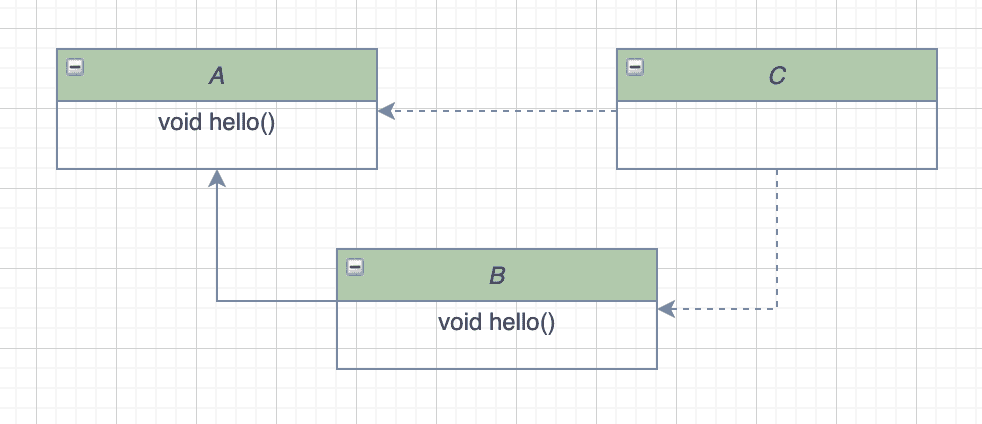
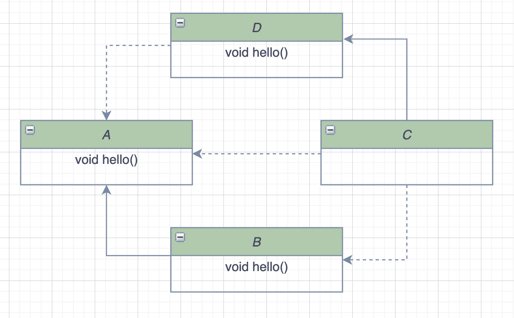
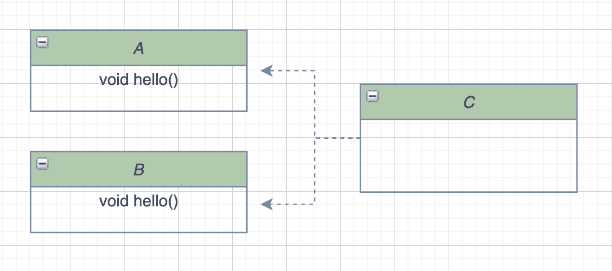
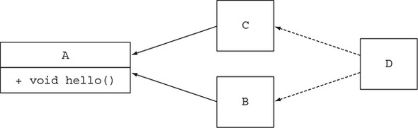

<h1>Part4. 매일 자바와 함께</h1>
<h2>1. null 대신 Optional 클래스</h2>
<h3>값이 없는 상황을 어떻게 처리할까?</h3>

```java
public class Person {

    private Car car;

    public Car getCar() {
        return car;
    }
}

public class Car {

    private Insurance insurance;

    public Insurance getInsurance() {
        return insurance;
    }
}

public class Insurance {

    private String name;

    public String getName() {
        return name;
    }
}
```

- Person을 통해서 Insurance.name을 얻으려면 연속된 참조가 필요.
- person.getCar().getInsurance().getName() 중 하나라도 null이라면 NPE가 발생될 수 있음.

<h3>NPE 줄이기</h3>

- 깊은 의심

```java
public String getCarInsuranceV1(Person person) {
    if (person != null) {
        CarV1 car = person.getCar();
        if (car != null) {
            Insurance insurance = car.getInsurance();
            if (insurance != null) {
                return insurance.getName();
            }
        }
    }
    return "Unknown";
}
```

- 너무 많은 메서드의 출구

```java
public String getCarInsuranceV2(Person person) {
    if (person == null) {
        return "Unknown";
    }
    CarV1 car = person.getCar();
    if (car == null) {
        return "Unknown";
    }
    Insurance insurance = car.getInsurance();
    if (insurance == null) {
        return "Unknown";
    }
    return insurance.getName();
}
```

- NPE에 안전해졌을 순 있지만, 가독성↓
- 값이 있거나 없음을 표현할 수 있는 방법 필요


<h3>null 때문에 발생하는 문제</h3>

---

- **에러의 근원**
    - NPE
- **코드를 어지럽힘**
    - 무수한 null check 코드는 메인 로직을 가려 가독성↓
- **아무 의미가 없음**
    - null은 의미없음을 뜻함
- **자바 철학에 위배**
    - 자바는 모든 포인터를 숨기지만 null포인터를 숨기지 못함
- **형식 시스템에 구멍을 만든다** 
    - null은 무형식, 정보가 없으며 모든 참조형식에 할당될 수 있음. 
    - 시스템에 null을 퍼뜨려 null의 근원지가 어딘지 알 수 없음.
    
> Java 8부터는 `선택형값 (스칼라, 하스켈)의 영향을 받아 Optional 클래스를 제공`

<br>

<h3>Optional 클래스 소개</h3>

---
- Optional은 선택형 값을 캡슐화 하는 클래스


- Optional에서 값이 있을 경우 Optional<>
- 없는 경우 `Optional.empty`라는 정적 메서드를 통해 특별한 싱글톤 인스턴스를 반환

    ```java
    private static final Optional<?> EMPTY = new Optional<>(null);
    ```

- null 참조는 NPE를 발생시키지만, `Optional.empty()는 객체`이므로 다양한 방식으로 활용 가능

- 이해하기 쉬운 API를 설계
- 매소드만으로 선택형값인지 필수값인지의 여부를 알 수 있음

```java
public class Person {

    private Car car;

		// 차가 없을 수 있음
    public Optional<Car> getCar() {
        return Optional.ofNullable(car);
    }
}

public class Car {

    private Insurance insurance;

		// 자동차 보험이 없을 수 있음
    public Optional<Insurance> getInsurance() {
        return Optional.ofNullable(insurance);
    }
}

public class Insurance {

    private String name;
		
		// 보험이 있다면 보험의 이름은 반드시 존재해야 함을 간접적으로 알 수 있음
    public String getName() {
        return name;
    }
}
```


<h3>Optional 적용 패턴</h3>

---

<h3>Optional 객체 생성</h3>

<h4>빈 Optional</h4>

```java
public static<T> Optional<T> empty() {
    @SuppressWarnings("unchecked")
    Optional<T> t = (Optional<T>) EMPTY;
    return t;
}
```

<h4>null이 아닌 값으로 Optional만들기</h4>

```java
public static <T> Optional<T> of(T value) {
		// value가 null이라면 NPE 발생
    return new Optional<>(Objects.requireNonNull(value));
}
```

<h4>null값으로 Optional 만들기</h4>

```java
@SuppressWarnings("unchecked")
public static <T> Optional<T> ofNullable(T value) {
    return value == null ? (Optional<T>) EMPTY
                         : new Optional<>(value);
}
```

<h4>map을 통해 Optional의 값을 추출하고 변환하기</h4>

```java
// Optional활용 전
String nae = null;
if (insurance != null) {
		name = insurance.getName();
}

// Optional활용
Optional<Insurance> optInsurance = Optional.ofNullable(insurance);
Optional<String> name = optInsurance.map(Insurance::getName);
```
- Optional 객체는 `최대 요소가 한 개 이하인 데이터 컬렉션`으로 취급할 수 있음.

<h3>flatMap을 통해 Optional 객체 연결</h3>

```java
public String getCarInsuranceName(Person person) {
		Optional<Person> optPerson = Optional.of(person);
		Optional<String> name = optPerson.map(Person::getCar) // (1)
				    .map(Car::getInsurance) // (2)
				    .map(Insurance::getName);
return name.orElse("Unknown");
```

- (1)의 반환타입은 Optional
- (2)는 getInsurance라는 메서드를 Optional에게 요청하고 있으므로 컴파일 에러
- Optional<Optional>와 같은 형식으로 진행되므로 문제가 발생 
    - 이를 해결 하기 위해 Stream API의 flatMap처럼 Optional도 `flatMap() 제공`

```java
public String getCarInsurnaceName(Optional<Person> person) {
		return Optional<String> name = person.flatMap(Person::getCar)
							.flatMap(Car::getInsurance)
							.map(Insurance::getName)
							.orElse("Unknown");
}
```

- 도메인 모델에 대한 암묵적인 지식에 의존하지 않고, 명시적인 형식 시스템을 정의 가능

- Optional을 인수로 받거나 Optional을 반환하는 메서드를 정의 
    - `이 메서드가 빈 값을 받거나 빈 결과를 반환할 수 있음을 잘 문서화`

<h4>Optional을 이용한 Person/Car/Insurance 참조 체인</h4>

- **flatMap()**
```java
public <U> Optional<U> flatMap(Function<? super T, ? extends Optional<? extends U>> mapper) {
    Objects.requireNonNull(mapper); // Function<T, R>은 null이면 안됨
    if (!isPresent()) {  // 자기 자신이 널이라면 EMPTY 반환
        return empty();
    } else {
        @SuppressWarnings("unchecked")
        Optional<U> r = (Optional<U>) mapper.apply(value); // apply이후 결과를
        return Objects.requireNonNull(r); // null체크 후 그대로 반환 -> Optional로 감싸지 않음
    }
}
```
- **map()**

```java
public <U> Optional<U> map(Function<? super T, ? extends U> mapper) {
    Objects.requireNonNull(mapper);
    if (!isPresent()) {
        return empty();
    } else {
        return Optional.ofNullable(mapper.apply(value)); // 전부 동일하지만, 반환시 Optional로 감싸서 반환
    }
}
```

- Optional은 직렬화 할 수 없음
- `선택형 반환값 만을 지원목적으로 OPtional을 설계`했기 때문에 Serializable 인터페이스를 구현X
- 직렬화 모델이 필요한 경우 Optional로 값을 반환할 수 있는 메서드를 추가 권장

```java
public class Car {

    private Insurance insurance;

    public Optional<Insurance> getInsurance() {
        return Optional.ofNullable(insurance);
    }
}
```

<h3>Optional 스트림 조작</h3>

- Optional을 포함하는 스트림을 쉽게 처리할 수 있도록 `stream()` 제공

```java
// Optional<T>에서 제공하는 메서드
public Stream<T> stream() {
    if (!isPresent()) {
        return Stream.empty();
    } else {
        return Stream.of(value);
    }
}
```

- 현재 Optional객체에 값이 있을 경우, `Stream으로 감싼 값` 반환
- 없을 경우, `empty` 반환
- 사용 예시

    ```java
    public Set<String> getCarInsuranceNames(List<Person> persons) {
        return persons.stream()
                .map(Person::getCar)
                .map(optCar -> optCar.flatMap(Car::getInsurance))
                .map(optInsurance -> optInsurance.map(Insurance::getName))
                .flatMap(Optional::stream) // Stream<Optional<T>> -> Stream<T>
                .collect(toSet());
    }
    ```

<h3>디폴트 액션 및 Optional unwrap</h3>

- **get()**
    - Optional에 있는 값을 꺼냄
    - 없을 경우 `NoSuchElementException`발생 (값이 확실하게 있을때만 사용)
- **orElse(T other)**
    - 값이 없을 경우 other 기본값 제공
- **orElseGet(Supplier<? extends T> other)**
    - orElse에 대응해 other가 로직 생성
    - 실제 값이 없을때만 해당 로직이 실행되도록 Supplier를 통해 지연가능
- **orElseThrow(Supplier<? extends X> exceptionSupplier)**
    - Optional이 비어있을때 예외 발생
    - get과 비슷하지만 발생 예외를 선택할 수 있음
- **ifPresent(Consumer<? super T> consumer)**
    - 값이 존재할때만 인수로 넘겨준 동작을 실행
    - 값이 없으면 아무일도 하지 않음
- **ifPresentOrElse(Consumer<? super T> action, Runnable emptyAction)**
    - isPrensnet와 동일
    - Optional이 비어있을때 Runnable 인수를 실행

<h3>두 Optional 합치기</h3>

```java
public Insurance findCheapestInsurance(Person person, Car car) {
    // 다른 보험사에서 제공한 질의 서비스
    // 모든 데이터 비교
    Insurance cheapestCompany = new Insurance();
    return cheapestCompany;
}

public Optional<Insurance> nullSafeFindCheapestInsurance(Optional<Person> person, Optional<Car> car) {
    if (person.isPresent() && car.isPresent()) {
        return Optional.of(findCheapestInsurance(person.get(), car.get()));
    } else {
        return Optional.empty();
    }
}
```
- flatMap과 map을 활용한 코드

```java
public Optional<Insurance> nullSafeFindCheapestInsuranceQuiz(Optional<Person> person, Optional<Car> car) {
    return person.flatMap(p -> car.map(c -> findCheapestInsurance(p, c)));
}
```
- null 체크는 메서드 내부에서 해주므로 하나라도 null이면 Optional.empty()가 실행


<h3>필터로 특정값 거르기</h3>

```java
Insurance insurance = ...;
if(insurance != null && "CambridgeInsurance".equals(insurance.getName())){
		System.out.println("ok");
}

Optional<Insurance> optInsurance = ...;
optInsurance.filter(insurance -> "CambridgeInsurance".equals(insurance.getName()))
        .ifPresent(x -> System.out.println("ok"));
```


<h3>4. Optional을 사용한 실용 예제</h3>

---
<h4>잠재적으로 null이 될 수 있는 대상을 Optional로 감싸기</h4>

```java
Object value = map.get("key"); // Map<K, V> map

Optional<Object> value = Optional.ofNullable(map.get("key"));
```

<h4>예외와 Optional 클래스</h4>

- 일부 자바 API는 값을 제공할 수 없을때 null이 아닌 예외를 발생시키기함 
    - e.g. (Integer.parseInt(…))
- Optional.empty()를 활용한 유틸 메서드 사용

```java
public static Optional<Integer> StringToInteger(String s) {
    try {
        return of(Integer.parseInt(s));
    } catch (NumberFormatException e) {
        return empty();
    }
}
```

<h4>기본형 Optional을 사용하지 말아야 하는 이유</h4>

- **기본형 특화 Optional을 사용 문제점**

    - Optional **최대 요소 수는 한 개**이므로 기본형 특화 Optional을사용해도 **성능의 큰 개선이 없음**
    - 기본형 특화 Optional은 **map, filter, flatMap을 지원하지 않음**
- 일반 Optional과 혼용하여 사용할 수 없음

<h2>새로운 날짜와 시간 API</h2>

<h3>Java 8이전에 제공해주던 시간, 날짜 라이브러리의 문제점 (java.util.Date)</h3>

- Date 클래스는 특정 시점을 날짜가 아닌 밀리초 단위로 표현
- 1900년을 기준으로 하는 오프셋
- 0에서 시작하는 달 인덱스 등 모호한 설계
- toString으로 반환되는 문자열 추가 활용 어려움
- Date는 JVM기본시간대인 CET를 활용 → 자체적으로 시간대 정보를 알고 있지 않음
- 대안으로 java.util.Calendar가 등장했지만 여전히 문제가 있음
    - 달의 인덱스는 여전히 0부터 시작
- Date, Calendar중 어떤 클래스를 사용해야 할지 혼동

> Java8에서는 많은 기능을 포함하고 보완한 java.time 패키지가 추가됐음

<h3>LocalDate, LocalTime, Instant, Duration, Period 클래스</h3>

---

<h4>LocalDate, LocalTime</h4>

- LocalDate (날짜를 표현)

    - 시간을 제외한 날짜를 표현하는 불변 객체

    - 어떤 시간대 정보도 포함하지 않음

    - 정적 팩토리 메서드 of로 인스턴스를 생성하거나, parse를 통해 생성할 수 있음
```java
LocalDate date = LocalDate.of(2023, 8, 22);

date = LocalDate.now(); // 현재 날짜 정보를 얻음

date = LocalDate.parse("2023-08-22");
년, 월, 일의 정보를 가져올 수 있음

int year = date.getYear(); // 2023
Month month = date.getMonth(); // AUGUST
int day = date.getDayOfMonth(); // 22
DayOfWeek dow = date.getDayOfWeek(); // TUESDAY
int len = date.lengthOfMonth(); // 31 (8월의 길이)
boolean leap = date.isLeapYear(); // false (윤년이 아님)

// ChronoField를 전달해 날짜 정보를 가져올 수 있음
int y = date.get(ChronoField.YEAR);
int m = date.get(ChronoField.MONTH_OF_YEAR);
int d = date.get(ChronoField.DAY_OF_MONTH);
```

- LocalTime (시간을 표현)
    - 시간, 분
    - 시간, 분, 초를 이용한 정적 팩토리 메서드 of
    - parse를 통해 생성
```java
LocalTime time = LocalTime.of(13, 45, 20); // 13:45:20
int hour = time.getHour(); // 13
int minute = time.getMinute(); // 45
int second = time.getSecond(); // 20

time = LocalTime.parse("13:45:20");
```

<h4>날짜 및 시간을 조합한 LocalDateTime</h4>

- LocalDateTime
    - LocalDate와 LocalTime을 쌍으로 갖는 복합 클래스
    - LocalTime에 날짜를 부여하여 생성
    - LocalDate에 시간을 부여하여 생성
    - 정적 팩토리 메서드 of
```java
LocalDateTime dt4 = date.atTime(time); // LocalDate date
LocalDateTime dt5 = time.atDate(date); // LocalTime time

LocalDateTime → LocalDate, LocalTime 추출 가능 (toLocalXxx 메서드)
```

<h4>Instant 클래스</h4>

- 기계의 날짜와 시간
- 기계 관점에서는 연속된 시간에서 특정 지점을 하나의 큰 수로 표현하는 방법
- UTC를 기준으로 특정 지점까지의 시간을 초로 표현
- 팩토리 메서드 ofEpochSecond에 초를 넘겨주며 인스턴스를 생성 (혹은 두번째 인수로 나노초를 넘겨주며 시간 보정 가능)
- 10억분의 1초(나노초)의 정밀도를 제공

```java
Instant instant = Instant.ofEpochSecond(44 * 365 * 86400);
Instant instant = Instant.ofEpochSecond(44 * 365 * 86400, 1_000_000_000); // 첫번째인수 + 1초
Instant now = Instant.now();
```

- now()를 통해 받은 시간은 사람이 읽을 수 있는 시간 정보를 제공X
    - 일반적인 ChronoField를 통해 값을 가져올 수 없음
> 대신 Duration, Period 클래스와 함께 활용이 가능함

<h4>Duration과 Period의 정의</h4>

- `Duration`은 두 시간 객체 사이의 지속시간을 생성(LocalDate 사용 불가)
- 정적 팩토리 메서드 between을 이용해 두 시간 객체사이의 지속성 생성(두 개의 LocalTime, LocalDateTime, Instant로 생성가능)

```java
LocalDateTime dt1 = LocalDateTime.of(2014, Month.MARCH, 18, 13, 45, 19); // 2014-03-18T13:45
LocalDateTime dt2 = LocalDateTime.of(2014, Month.MARCH, 19, 13, 45, 20); // 2014-03-18T13:45
LocalTime time = LocalTime.of(13, 45, 20); // 13:45:20
Instant instant = Instant.ofEpochSecond(44 * 365 * 86400);
Instant now = Instant.now();

Duration d1 = Duration.between(LocalTime.of(13, 45, 10), time); // LocalTime, LocalTime
Duration d2 = Duration.between(instant, now); // Instant, Instant

Duration d3 = Duration.between(time, dt1); // LocalTime, LocalDateTime (더 작은 범위 ~ 큰 범위 가능)
// Duration d4 = Duration.between(dt1, time); // LocalDateTime, LocalTime (큰 범위 ~ 작은 범위 불가능)

// Instant는 다른 클래스와 혼용 불가능
// Duration d5 = Duration.between(instant, dt1);
// Duration d6 = Duration.between(time, instant);
```

- 년, 월, 일로 시간을 표현하려면 `Period` 클래스 사용

```java
public static Period between(LocalDate startDateInclusive, LocalDate endDateExclusive) {
    return startDateInclusive.until(endDateExclusive);
}
```

<h3>날짜 조정, 파싱 formatting</h3>

---

<h4>날짜 조정</h4>

```java
LocalDate date1 = LocalDate.of(2017, 9, 21);
LocalDate date2 = date1.withYear(2011); // 2011-09-21
LocalDate date3 = date2.withDayOfMonth(25); // 2011-09-25
LocalDate date4 = date3.with(ChronoField.MONTH_OF_YEAR, 2); // 2011-02-25

// 선언형 방식
LocalDate date1 = LocalDate.of(2017, 9, 21);
LocalDate date2 = date1.plusWeeks(1);
LocalDate date3 = date2.minusYears(6);
LocalDate date4 = date3.plus(6, 
ChronoUnit.MONTHS);
```

- 기존 LocalDate를 고치지 않고, 새로운 인스턴스를 반환하여 날짜를 변경 가능

<h4>TemporalAdjuster 사용하기</h4>

- 다음 주 일요일, 돌아오는 평일, 이번달의 마지막날과 같은 좀 더 세밀하고 복잡한 날짜 조정 기능을 제공
- with 메서드에서 다양한 동작을 수행하는 TemporalAdjusters를 전달하여 사용 가능

```java
LocalDate date = LocalDate.of(2014, 3, 18);
date = date.with(nextOrSame(DayOfWeek.SUNDAY));
date = date.with(lastDayOfMonth());
```

- FunctionalInterface이기 때문에 기능 확장 가능

```java
class NextWorkingDay implements TemporalAdjusters {
    @Override
    public Temporal adjustInto(Temporal temporal) {
        DayOfWeek dow = DayOfWeek.of(temporal.get(ChronoField.DAY_OF_WEEK));
        int dayToAdd = 1;
        if (dow == DayOfWeek.FRIDAY) {
            dayToAdd = 3;
        }
        if (dow == DayOfWeek.SATURDAY) {
            dayToAdd = 2;
        }
        return temporal.plus(dayToAdd, ChronoUnit.DAYS);
    }
}

// 사용
date = date.with(new NextWorkingDay());

// 람다 활용: 토요일, 일요일은 건너뛰고 날짜를 하루씩 다음날로 바꿈
date = date.with(temporal -> {
    DayOfWeek dow = DayOfWeek.of(temporal.get(ChronoField.DAY_OF_WEEK));
    int dayToAdd = 1;
    if (dow == DayOfWeek.FRIDAY) {
        dayToAdd = 3;
    }
    if (dow == DayOfWeek.SATURDAY) {
        dayToAdd = 2;
    }
    return temporal.plus(dayToAdd, ChronoUnit.DAYS);
});
```

<h4>날짜와 시간 객체 출력 및 파싱</h4>

- java.time.format는 포맷팅과 파싱 전용 패키지
- 주로 DateTimeFormatter의 정적 팩토리 메서드 및 상수를 활용 하여 포맷터 생성 가능

```java
LocalDate date = LocalDate.of(2014, 3, 18);
DateTimeFormatter formatter = DateTimeFormatter.ofPattern("dd/MM/yyyy");
DateTimeFormatter italianFormatter = DateTimeFormatter.ofPattern("d. MMMM yyyy", Locale.ITALIAN);

// basic 포맷팅
String basicFormat1 = date.format(DateTimeFormatter.ISO_LOCAL_DATE);
String basicFormat2 = date.format(DateTimeFormatter.BASIC_ISO_DATE);
System.out.println(basicFormat1);
System.out.println(basicFormat2);

// basic 포맷팅 -> basic 파싱
LocalDate basicFormat1Parse1 = LocalDate.parse(basicFormat1, DateTimeFormatter.ISO_LOCAL_DATE);
LocalDate basicFormat2Parse2 = LocalDate.parse(basicFormat2, DateTimeFormatter.BASIC_ISO_DATE);
System.out.println(basicFormat1Parse1);
System.out.println(basicFormat2Parse2);

// 커스텀 formatter 포맷팅
System.out.println(date.format(formatter));
System.out.println(date.format(italianFormatter));

// Builder 활용한 커스텀 포맷터 생성
DateTimeFormatter complexFormatter = new DateTimeFormatterBuilder()
        .appendText(ChronoField.DAY_OF_MONTH)
        .appendLiteral(". ")
        .appendText(ChronoField.MONTH_OF_YEAR)
        .appendLiteral(" ")
        .appendText(ChronoField.YEAR)
        .parseCaseInsensitive()
        .toFormatter(Locale.ITALIAN);

System.out.println(date.format(complexFormatter));

// 결과
2014-03-18
20140318
2014-03-18
2014-03-18
18/03/2014
18. marzo 2014
18. marzo 2014
```

<h3>다양한 시간대 및 캘린더 활용</h3>

---

- `java.time.ZoneId` 클래스는 시간대에 관련된 정보를 제공 (Summer Time과 같은 복잡한 사항들이 자동 적용됨)
- ZoneId를 가져오거나, 기존 java.util.TimeZone 객체를 ZoneId로 변경 가능

```java
// 사용
ZoneId seoulZone = ZoneId.of("Asia/Seoul");
ZoneId defaultZone = TimeZone.getDefault().toZoneId();
```

- ZoneId 객체를 LocalDate, LocalDateTime, Instant를 이용해 ZonedDateTime 인스턴스로 변환가능

```java
LocalDate date = LocalDate.of(2023, 8, 22);
ZonedDateTime zonedDateTime1 = date.atStartOfDay(seoulZone);

LocalDateTime dateTime = LocalDateTime.of(2023, 8, 22, 15, 10);
ZonedDateTime zonedDateTime2 = dateTime.atZone(seoulZone);

Instant now = Instant.now();
ZonedDateTime zonedDateTime3 = now.atZone(seoulZone);

System.out.println(zonedDateTime1);
System.out.println(zonedDateTime2);
System.out.println(zonedDateTime3);

// 결과 -> 시간이 바뀌진 않고 해당 시간이 어디 지역인지 표시됨
2023-08-22T00:00+09:00[Asia/Seoul]
2023-08-22T15:10+09:00[Asia/Seoul]
2023-08-22T17:30:26.115524+09:00[Asia/Seoul]
Instant to LocalDateTime

Instant now = Instant.now();
ZoneId londonZone = ZoneId.of("Europe/London");
LocalDateTime localDateTime = LocalDateTime.ofInstant(now, londonZone);
System.out.println(localDateTime);

// 결과
2023-08-22T09:39:05.472433 // 현재 시간을 지정한 zone의 시간을 기준으로 가져옴(런던은 한국 기준 -9시간)
```
<h4>LocatDate, LocalTime, LocalDateTime, ZoneId, ZonedDateTime의 포함관계</h4>


<h4>UTC/Greenwich 기준의 고정 오프셋</h4>

- ZoneId의 하위 클래스인 `ZoneOffset `클래스는 본초자오선을 기준으로 시간을 더하고, 빼며 커스텀한 시간대의 차이를 생성

- 뉴욕의 경우 본초자오선보다 5시간 느리므로 다음과 같이 표현

```java
// 오프셋을 이용해 OffsetDateTime을 구할 수 있음
LocalDateTime dateTime = LocalDateTime.of(2022, 8, 22, 14, 0);
OffsetDateTime offsetDateTime = OffsetDateTime.of(dateTime, newYorkOffset);
System.out.println(offsetDateTime);

// 결과
2022-08-22T14:00-05:00
```

<h4>대안 캘린더 시스템</h4>

- Java 8부터 여러 나라의 캘린더 시스템(ThaiBuddhistDate, MinguoDate, JapaneseDate, HijrahDate)제공

<h2>3. 디폴트 메서드</h3>

- 자바 8에서는 기본 구현을 포함하는 인터페이스를 정의하는 두 가지 방법을 제공  
    - 인터페이스 `내부에 정적 메서드` 사용
    - 인터페이스의 기본 구현을 제공할 수 있도록 `디폴트 메서드 기능` 사용

- 기존 인터페이스를 구현하는 클래스는 자동으로 인터페이스에 추가된 새로운 메서드의 디폴트 메서드 상속
- 기존의 코드 구현을 바꾸지 않고 인터페이스 변경 가능
- default라는 키워드로 시작
- 다른 클래스에 선언된 메서드처럼 메서드 바디를 포함하여 `소스 호환성`이 유지

<h3>호환성</h3>

- 바이너리 호환성
    - 뭔가를 바꾼 이후에도 에러 없이 기존 바이너리가 실행될 수 있는 상황
- 소스 호환성
    - 코드를 고쳐도 기존 프로그램을 성공적으로 재컴파일할 수 있는 상황
- 동작 호환성
    - 코드를 바꾼 다음에도 같은 입력값이 주어지면 프로그램이 같은 동작을 실행하는 상황

<h3>디폴트 매서드 활용 패턴</h3>

---

- **선택형 메서드**
    - 자바 8전 인터페이스를 구현하는 클래스는 사용하지 않는 메서드에 대해 비어있는 메서드까지 필수적으로 구현해야함
    - 디폴트 메서드를 이용하면 `메서드의 기본 구현을 인터페이스로부터 제공받기 때문에 빈 구현을 제공할 필요X`
    - 이를 통해 `불필요한 코드의 양을 줄임`
    
<br>

- **동작 다중 상속**
    - 자바에서 클래스는 한 개의 다른 클래스만 상속할 수 있지만 `인터페이스는 여러 개 구현`할 수 있음
    - 메서드가 중복되지 않는 최소한의 인터페이스를 유지한다면 `코드에서 동작을 쉽게 재사용하고 조합 가능`

<h3>해석 규칙</h3>

---

1. **클래스가 항상 이긴다.**

- 클래스나 슈퍼클래스에서 정의한 메서드가 디폴트 메서드보다 우선

2. 1번 규칙 이외의 상황에서는 **서브인터페이스가 이긴다.**

- 상속관계를 갖는 인터페이스에서 같은 시그니처를 갖는 메서드를 정의할 때는 서브인터페이스가 이김

3. 여전히 디폴트 메서드의 우선순위가 결정되지 않은 경우 **여러 인터페이스를 상속받는 클래스가 명시적으로 디폴트 메서드를 오버라이드하고 호출**해야 한다.

<h4>디폴트 메서드를 제공하는 서브 인터페이스가 이긴다.</h4>



- 인터페이스 A, B가 존재하며 클래스 C가 B와 A를 구현
- C에서 호출하는 hello는 2번 규칙에 따라 B의 hello가 실행



```java
public class D implements A { }
public class C extends D implements B, A {
	public static void main(String... args) {
		new C().hello();
	}
}
```

- **클래스 D는 hello를 오버라이드하지 않았고 단순히 인터페이스 A를 구현**
- D는 인터페이스 A의 디폴트 메서드 구현을 상속
- 2번 규칙에 따라 클래스나 슈퍼클래스에 메서드 정의가 없을 때는 디폴트 메서드를 정의하는 서브 인터페이스가 선택
- 따라서 컴파일러는 인터페이스 A와 B의 hello 중 하나를 선택하는데 B가 A를 상속받는 관계이므로 B의 hello가 실행

- **만약 D가 hello를 오버라이드 했다면** 클래스인 D가 슈퍼 클래스의 메서드를 정의된 것이기 때문에 D의 hello가 실행

<h4>충돌 그리고 명시적인 문제해결</h4>



```java
public interface A {
	default void hello() { ... }
}

public interface B {
	default void hello() { ... }
}

public class C implements B, A { }
```

- A와 B 인터페이스 간의 상속관계도 없어 디폴트 메서드의 우선순위가 결정되지 않음
- 자바 컴파일러는 `어떤 메서드를 호출해야 할지 알 수 없어 에러 발생`
- 충돌해결을 위해서는 직접 클래스 C에서 사용하려는 메서드를 `명시적으로 선택`해야 함

```java
public class C implements B, A {
	void hello() {
		B.super.hello();
	}
}
```

<h4>다이아몬드 문제</h4>



```java
public interface A {
	default void hello() { ... }
}

public interface B extends A { }
public interface C extends A { }

public class D implements B, C { 
	public static void main(String... args) {
		new D().hello();
	}
}
```

- D가 구현하는 B와 C 중 선택할 수 있는 메서드는 A의 디폴트 메서드 뿐이기 때문에 D는 A의 hello를 호출
- 만약 B에 같은 디폴트 메서드 hello가 있었다면 가장 하위의 인터페이스인 B의 hello가 호출
- B와 C가 모두 디폴트 메서드를 정의했다면 디폴트 메서드 우선순위로 인해 에러가 발생하고 명시적인 호출이 필요
- 만약 C에서 디폴트 메서드가 아닌 추상메서드 hello를 추가될 경우, C는 A를 상속
    ```java
    public interface C extends A {
	void hello();
    }
    ```
    - C의 추상 메서드 hello가 A의 디폴트 메서드 hello보다 우선
    - B와 C중 선택하지 못하며 컴파일에러가 발생

<h2>4. 자바 모듈 시스템</h2>
<h3>압력: 소프트웨어 유추</h3>

---

<h4>관심사 분리</h4>

- Separation of Concern 은 컴퓨터 프로그램을 고유의 기능으로 나누는 동작을 권장하는 원칙
- 클래스를 그룹화한 모듈을 이용해 어플리케이션의 클래스간의 관계를 시각적으로 보여줌
    - 개별 기능으로 나누어 팀이 쉽게 협업 가능
    - 개별 기능 재사용 용이
    - 전체 시스템 유지보수 용이

<h4>정보 은닉</h4>

- 세부구현을 숨기도록 장려하는 원칙
- 개발시 요구사항이 자주 바뀌기 때문에 사용 권장
- 세부구현을 숨김으로써 프로그램의 부분을 바꿨을때 다른 부분까지 영향을 미칠 가능성↓
- 캡슐화된 코드의 내부적 변화가 외부에 끼칠 영향↓
- private 제어자로 컴파일러가 캡슐화를 확인할 수 있었는데 이는 자바9 이전까지 의도된대로 공개되었는지 확인 불가

<h4>자바 소프트웨어</h4>

- 특정문제와 관련된 패키지, 클래스, 인터페이스를 그룹으로 만들어 코드를 그룹화
- UML 다이어그램를 통해 코드 의존성을 시각적으로 보여줄 수 있음

<h3>자바 모듈 시스템을 설계한 이유</h3>

---

- 이전에는 클래스, 패키지, JAR 세가지 수준의 코드 그룹화 제공
- 클래스 관련해 접근제한자와 캡슐화 지원
- 패키지와 JAR 수준에서는 캡슐화를 거의 지원X

<h4>모듈화의 한계</h4>

- **제한된 가시성 제어**
    - public, protected, default, private 네가지 가시성 접근자 
    - 한 패키지의 클래스와 인터페이스를 다른 패키지로 공개하기 위해서는 public으로 선언 ->
    클래스와 인터페이스 모두 공개
- **클래스 경로**
    - 클래스를 모두 컴파일 -> 한개의 jar 파일에 넣기 -> 클래스 경로에 JAR 파일을 추가
    - JVM이 동적으로 클래스 경로에 정의된 클래스 로딩
    - 클래스 경로에는 같은 클래스를 구분하는 버전 개념X
    - `다양한 컴포넌트가 같은 라이브러리의 다른 버전을 사용할 경우 문제`
    - 클래스 경로는 명시적인 의존성을 지원X
    - 각각의 JAR 안에 있는 모든 클래스는 classes로 합쳐짐
    - 하나의 JAR이 다른 JAR에 포함된 클래스 집합을 사용하라고 명시적으로 의존성을 정의하는 기능 제공X

> 메이븐이나 그레들 같은 빌드 도구를 사용해 문제를 해결

- 자바 자체적으로는 명시적 의존성 정의 지원X

<h4>거대한 JDK</h4>

- 자바 프로그램을 만들고 실행하는데 도움을 주는 도구의 집합
    - 자바 프로그램을 컴파일하는 javac 
    - 애플리케이션을 로드하고 실행하는 java
    - 입출력 호함 런타임 지원을 제공하는 JDK 라이브러리,컬렉션,스트림 등
- JDK 자체도 모듈화할 수 있는 자바 모듈 시스템 설계의 필요성 제기
- JDK에서 필요한 부분만 골라쓰고, 클래스 경로를 쉽게 유추할 수 있으며, 플랫폼을 진화시킬 수 있는 강력한 캡슐화를 제공할 건축구조 필요

<h4>OSGI와 비교</h4>

- 자바의 공식 기능X
- JVM에서 모듈화 애플리케이션을 구현하는 표준으로 자리잡음
- 번들 동작에 필요한 외부패키지가 무엇이며 어떤 내부 패키지가 외부로 노출되어 다른번들로 제공되는지 서술 정의하는 `텍스트파일`
- OSGi의 각 번들이 자체적 클래스 로더를 갖는 반면, 자바9 모듈 시스템의 직소는 애플리케이션당 한 개의 클래스 사용

<h3>자바 모듈: 큰 그림</h3>

---

- 자바8은 모듈이라는 새로운 자바 프로그램 구조단위를 제공
- module이라는 새 키워드에 이름과 바디 추가 정의
- 모듈 디스크립터는 moduel-info.java라는 파일에 저장
**module 모듈명**<br>
**exports 패키지명**<br>
**requires 모듈명**<br>
- IDE가 메이븐 같은 도구에서 모듈의 많은 세부사항을 처리

- 과정:
    - **어플리케이션 셋업**
        - 개념을 모델링 할 여러 클래스와 인터페이스 정의
        - 각 기능을 그룹화
    - **세부적인 모듈화와 거친 모듈화**
        - 모듈화를 할 경우 모듈의 크기를 결정해야함
        - `세부적 모듈화`: 모든 패키지가 자신의 모듈을 갖음
        - `거친 모듈화`: 한 모듈이 시스템의 모든 패키지 포함

<h3>여러 모듈 활용하기</h3>

---

- exports 구문
    - exports는 특정 패키지를 다른 모듈에서 사용할 수 있도록 공개 형식으로 만드는 역할
- requires 구문
    -requires는 의존하는 모듈을 지정
    - 예를 들어 java.base는 기본적으로 필요한 모듈이므로 명시적으로 지정할 필요X
- 이름 정하기
    - 모듈 이름은 인터넷 도메인명 역순으로 권고

<h3>컴파일과 패키징</h3>

---

- 프로젝트를 컴파일하기 위해 메이븐 등의 빌드 도구를 사용
- 각 모듈에는 pom.xml을 추가하고 의존성을 설정
- 최상위 pom.xml에서 각 모듈을 정의하고, mvn clean package 명령을 통해 모듈을 JAR 파일로 생성
- 생성된 JAR 파일을 모듈 경로에 포함하여 모듈 애플리케이션을 실행

<h3>자동 모듈</h3>

---

14.7 자동 모듈:

- 자동 모듈은 module-info.java 파일이 없는 JAR 파일
- `--describe-module` 인수를 사용하여 자동 모듈의 이름을 지정가능
    - 모듈 경로에 추가하여 애플리케이션을 실행

<h3>모듈 정의와 구문들</h3>

---

<h4>requires</h4>

- 컴파일 타임과 런타임에 모듈 간의 의존성을 정의
- 인수로 `모듈명`을 받음
```java
module com.iteratrlearning.application {
    requires com.iteratrlearning.ui;
}
```
<h4>exports</h4>

- 지정한 패키지를 다른 모듈에서 사용할 수 있도록 공개 형식으로 만들어줌
- 인수로 `패키지명`을 받음
- 공개할 패키지를 명시적으로 지정하여 캡슐화함

<h4>requires transitive</h4>

- 다른 모듈이 제공하는 공개 형식을 사용할 수 있도록 지정
```java
module com.iteratrlearning.ui {
    requires transitive com.iteratrlearning.core;
    
    exports com.iteratrlearning.ui.panels;
    exports com.ireratrlearning.ui.widgets;
}

module com.iteratrlearning.application {
    requires com.iteratrlearning.ui;
}
```
<h4>exports to</h4>

- 공개할 패키지를 제한하여 가시성 제어
```java
module com.iteratrlearning.ui {
    requires com.iteratrlearning.core;
    
    exports com.iteratrlearnig.ui.panels;
    exports com.iteratrlearnig.ui.widgets to com.iteratrlearnig.ui.widgetuser;
}
```
<h4>open과 opens</h4>

- 모듈 선언시 open 한정자로 `다른 모듈이 모든 패키지 접근 허용`
- 모듈 선언시 opens 구문으로 `필요한 개별 패키지만 개방`
- exports-to 로 노출한 패키지를 사용할 수 있는 모듈을 한정하듯, `open to로 반사적 접근을 특정모듈에만 허용`

<h4>uses와 provides</h4>

- uses
    - 서비스 소비자 지정
- provides
    - 서비스 제공자 지정